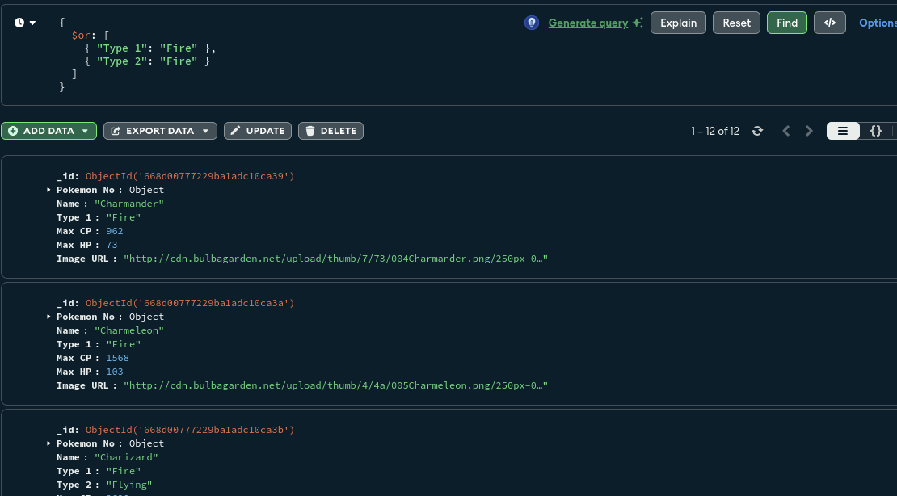
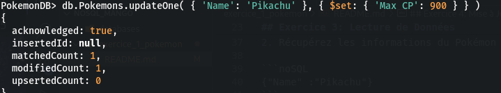
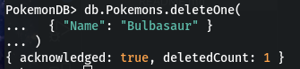

## Préparation

1. Importez les données du fichier `pokemonGO.csv` dans votre base de données MongoDB avant de commencer les exercices.

## Exercice 1: Création d'une Base de Données et d'une Collection

**Objectif :** Créer une base de données `PokemonDB` et une collection `Pokemons`.

### Instructions

1. Lancez `mongosh` pour démarrer le shell MongoDB.
2. Créez une base de données nommée `PokemonDB`.
3. Dans `PokemonDB`, créez une collection nommée `Pokemons`.

## Exercice 2: Insertion de Données

**Objectif :** Insérer les données des Pokémon à partir du fichier `pokemonGO.csv` dans la collection `Pokemons`.

### Instructions

Utilisez la fonction d'importation de MongoDB ou une commande d'insertion pour ajouter les données dans votre collection `Pokemons`.

## Exercice 3: Lecture de Données

**Objectif :** Lire les données de certains Pokémon spécifiques.

1. Trouvez tous les Pokémon de type "Feu".
```noSQL
db.Pokemons.find({
  $or: [
    { "Type 1": "Fire" },
    { "Type 2": "Fire" }
  ]
})
```


2. Récupérez les informations du Pokémon nommé "Pikachu".

```noSQL
{"Name" :"Pikachu"}
```
## Exercice 4: Mise à Jour de Données

**Objectif :** Mettre à jour les informations d'un Pokémon.

### Instructions

Mettez à jour les points de combat (`CP`) de "Pikachu" pour qu'ils soient de 900.

```noSQL
db.Pokemons.updateOne({
    'Name': 'Pikachu'},
    {$set: {'Max CP': 900}
})
```


## Exercice 5: Suppression d'Éléments

**Objectif :** Supprimer un Pokémon de la base de données.

### Instructions

Supprimez le Pokémon "Bulbasaur" de la collection `Pokemons`.

```noSQL
db.Pokemons.deleteOne(
  { "Name": "Bulbasaur" }
)
```


## Validation

Après avoir complété chaque exercice, utilisez les commandes appropriées pour vérifier que vos opérations ont été réalisées correctement.
