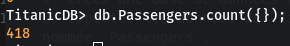
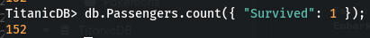
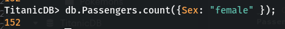
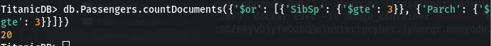
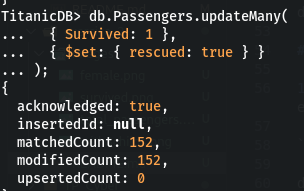
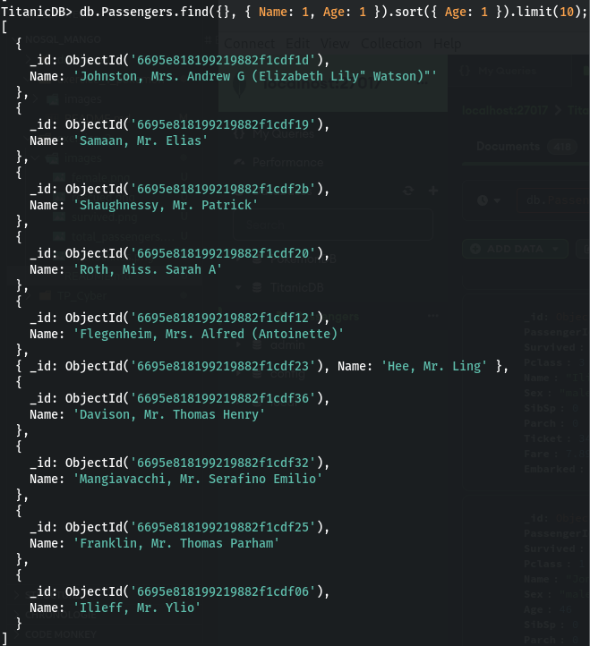
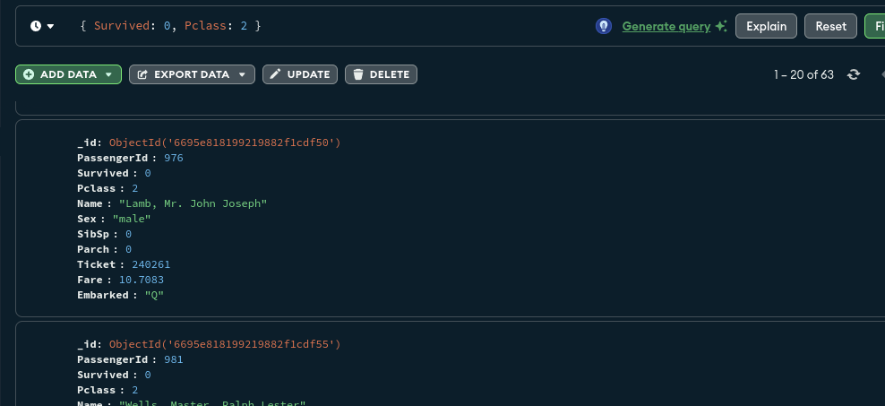
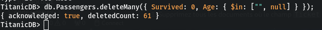
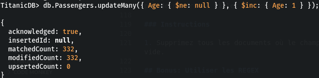

# Exercices Avancés MongoDB avec la Base de Données Titanic

Ces exercices avancés vous permettront de manipuler et d'analyser les données du [Titanic](../databases/ti) à partir du fichier `titanic.csv` en utilisant MongoDB.

## Préparation

1. Importez les données du fichier `titanic.csv` dans votre base de données MongoDB avant de commencer les exercices.

## Exercice 1: Importation et Création de la Collection

**Objectif :** Importer les données du fichier `titanic.csv` dans une collection `Passengers` de la base de données `TitanicDB`.

### Instructions

1. Créez une base de données nommée `TitanicDB`.
2. Importez les données de `titanic.csv` dans une collection nommée `Passengers`.

## Exercice 2: Analyse des Données

**Objectif :** Effectuer des opérations de lecture et d'analyse sur les données.

### Instructions

1. Comptez le nombre total de passagers.
```noSQL
db.Passengers.count({});
```


2. Trouvez combien de passagers ont survécu.
```noSQL
db.Passengers.count({ "Survived":1});
```



3. Trouvez le nombre de passagers femmes.
```noSQL
db.Passengers.count({Sex: "female" });
```


4. Trouvez le nombre de passagers avec au moins 3 enfants.
```noSQL
db.Passengers.countDocuments({'$or': [{'SibSp': {'$gte': 3}}, {'Parch': {'$gte': 3}}]})

```


## Exercice 3: Mise à Jour de Données

**Objectif :** Corriger ou ajouter des informations à certains documents.

### Instructions

1. Mettez à jour les documents pour lesquels le port d'embarquement est manquant, en supposant qu'ils sont montés à bord à Southampton.

```noSQL

db.Passengers.updateMany(
  { Embarked: { $in: ["", null] } },
  { $set: { Embarked: "S" } }
);

```
2. Ajoutez un champ `rescued` avec la valeur `true` pour tous les passagers qui ont survécu.

```noSQL

db.Passengers.updateMany(
  { Survived: 1 },
  { $set: { rescued: true } }
);

```


## Exercice 4: Requêtes Complexes

**Objectif :** Effectuer des requêtes plus complexes pour analyser les données.

### Instructions

1. Sélectionnez les noms des 10 passagers les plus jeunes.

2. Identifiez les passagers qui n'ont pas survécu et qui étaient dans la 2e classe.

```noSQL
db.Passengers.find(
  { Survived: 0, Pclass: 2 },
);
```

## Exercice 5: Suppression de Données

**Objectif :** Supprimer des données spécifiques de la base de données.

### Instructions

Supprimez les enregistrements des passagers qui n'ont pas survécu et dont l'âge est inconnu.

```noSQL
db.Passengers.deleteMany({ Survived: 0, Age: { $in: ["", null] } });
```


## Exercice 6: Mise à Jour en Masse

**Objectif :** Augmenter l'âge de tous les passagers de 1 an.

### Instructions

1. Utilisez une opération de mise à jour pour augmenter la valeur du champ `Age` de 1 pour tous les documents.

```noSQL
db.Passengers.updateMany({ Age: { $ne: null } }, { $inc: { Age: 1 } });
```

## Exercice 7: Suppression Conditionnelle

**Objectif :** Supprimer les enregistrements des passagers qui n'ont pas de numéro de billet (`Ticket`).

### Instructions

1. Supprimez tous les documents où le champ `Ticket` est absent ou vide.


## Validation

Utilisez les commandes MongoDB appropriées pour valider les résultats de chaque exercice. Assurez-vous que les opérations de mise à jour, d'insertion, et de suppression ont été effectuées correctement.


## Validation

Après avoir complété chaque exercice, utilisez les commandes appropriées pour vérifier que vos opérations ont été réalisées correctement.
