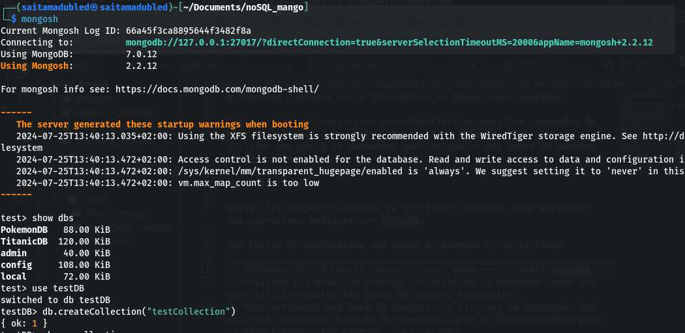
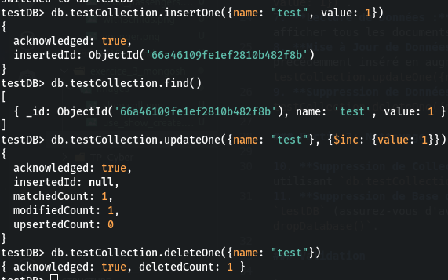

# Exercice Pratique sur l'Utilisation de Mongo Shell (mongosh)

Cet exercice est conçu pour vous familiariser avec les commandes de base de `mongosh`, le shell interactif de MongoDB. Vous allez utiliser une série de commandes pour manipuler des bases de données et des collections.

## Instructions

Suivez les étapes ci-dessous en utilisant `mongosh` pour effectuer des opérations basiques sur MongoDB.

### Partie 1: Exploration des Bases de Données et Collections

1. **Connexion :** Lancez `mongosh` pour démarrer le shell MongoDB.
2. **Lister les Bases de Données :** Utilisez la commande `show dbs` pour afficher toutes les bases de données existantes.
3. **Sélectionner une Base de Données :** Utilisez la commande `use` suivie du nom d'une base de données existante ou d'une nouvelle pour la sélectionner. Par exemple, `use testDB`.
4. **Créer une Collection :** Créez une nouvelle collection nommée `testCollection` en utilisant `db.createCollection("testCollection")`.
5. **Afficher les Collections :** Utilisez la commande `show collections` pour lister toutes les collections de la base de données actuelle.

### Partie 2: Manipulation des Données

6. **Insertion de Données :** Insérez un document dans `testCollection` avec `db.testCollection.insertOne({name: "test", value: 1})`.
7. **Lecture de Données :** Utilisez `db.testCollection.find()` pour afficher tous les documents dans `testCollection`.
8. **Mise à Jour de Données :** Mettez à jour le document précédemment inséré en augmentant `value` de 1 avec `db.testCollection.updateOne({name: "test"}, {$inc: {value: 1}})`.
9. **Suppression de Données :** Supprimez le document avec `db.testCollection.deleteOne({name: "test"})`.

### Partie 3: Nettoyage

10. **Suppression de Collection :** Supprimez `testCollection` en utilisant `db.testCollection.drop()`.
11. **Suppression de Base de Données :** Supprimez la base de données `testDB` (assurez-vous d'avoir sélectionné `testDB`) avec `db.dropDatabase()`.

### Validation

À chaque étape, utilisez les commandes appropriées pour vérifier que vos actions ont été correctement exécutées. Cela comprend l'utilisation de `find()`, `show dbs`, et `show collections` pour confirmer les modifications apportées à la base de données et aux collections.